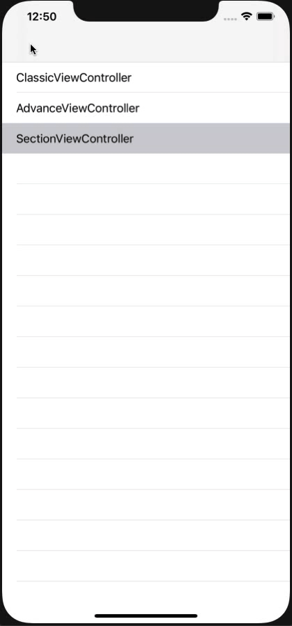

# ASTextField

[](https://travis-ci.org/amitpstu1@gmail.com/ASTextField)
[](https://cocoapods.org/pods/ASTextField)
[](https://cocoapods.org/pods/ASTextField)
[](https://cocoapods.org/pods/ASTextField)

Screenshots
---------



    
## Example
```swift

import ASTextField


@IBOutlet weak var firstNameTextField: ASTextFieldClassic!


firstNameTextField
.setName("First Name", true)
.setDelegate(self)
.setText("Amit", inputProps)
.setTitleFromName(inputProps)
.setErrorTitle("", errorProps)
.setBoxHorizontalPadding(boxHorizontalPadding)
.setBoxVerticalPadding(boxVerticalPadding)
.setLeftIcon(UIImage(named: GlobalVariable.userIcon), leftInputIconMultiplier, {textField, imageView, isOn in print(textField.getName() ?? "") })

```

## Import Statement
```swift
import ASTextField
```

## Setup Outlet
```swift
@IBOutlet weak var firstNameTextField: ASTextFieldClassic!
```

## Property Binding
```swift

firstNameTextField
.setName("First Name", true)
.setDelegate(self)
.setText("Amit", ASTTextProps(UIFont.systemFont(ofSize: 12), .darkGray))
.setTitleFromName(ASTTextProps(UIFont.systemFont(ofSize: 12), .darkGray))
.setErrorTitle("", errorProps)
.setNameAsTitle(ASTTextProps(UIFont.systemFont(ofSize: 10), .black))
.setBoxHorizontalPadding(15)
.setBoxVerticalPadding(0)
.setLeftIcon(UIImage(named: GlobalVariable.userIcon), ASTMultiplier(0.4, 0.4), {textField, imageView, isOn in print(textField.getName() ?? "") })

```

## Requirements

## Installation

ASTextField is available through [CocoaPods](https://cocoapods.org). To install
it, simply add the following line to your Podfile:

```ruby
pod 'ASTextField'
```

## Author

amitpstu1@gmail.com, amitpstu1@gmail.com

## License

ASTextField is available under the MIT license. See the LICENSE file for more info.
